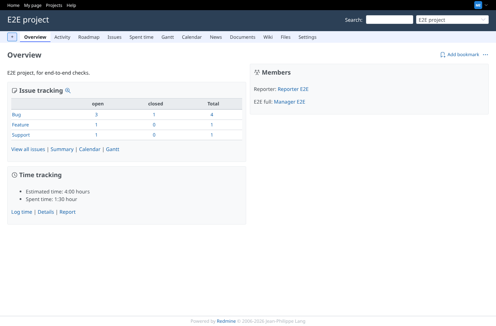
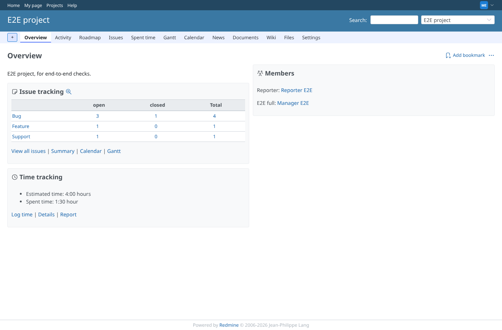

# api

Run 2026-10-06T20:16:40.273Z against http://127.0.0.1:3000.

| screenshot | user | URL | shows |
|---|---|---|---|
|  | manager | `/projects/e2e-project` | After POST /stealth/toggle.json toggle=true the manager's pages show stealth on |
|  | manager | `/projects/e2e-project` | After the API calls (last one toggle=false; refused calls changed nothing) stealth is off |

## Calls

```
manager, basic auth: POST /stealth/toggle.json toggle=true -> 200 {"is_cloaked":true}
manager, API key: POST /stealth/toggle.xml toggle=false -> 200 <?xml version="1.0" encoding="UTF-8"?><is_cloaked>false</is_cloaked>
manager, API key, no toggle param: POST /stealth/toggle.json -> 200 {"is_cloaked":true}
manager, API key: POST /stealth/toggle.json toggle=false -> 200 {"is_cloaked":false}
reporter (no permission), basic auth: POST /stealth/toggle.json toggle=true -> 403 
outsider, basic auth: POST /stealth/toggle.json toggle=true -> 403 
no credentials: POST /stealth/toggle.json toggle=true -> 401 
wrong API key: POST /stealth/toggle.json toggle=true -> 401 
manager session cookie only (no key): POST /stealth/toggle.json toggle=true -> 401 
```
