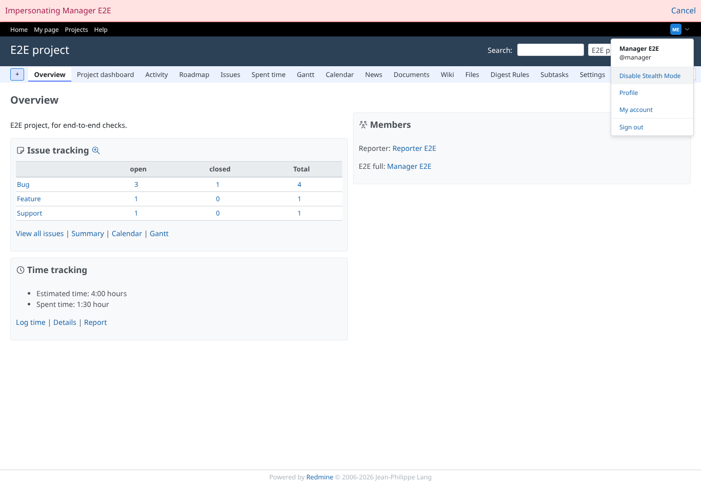
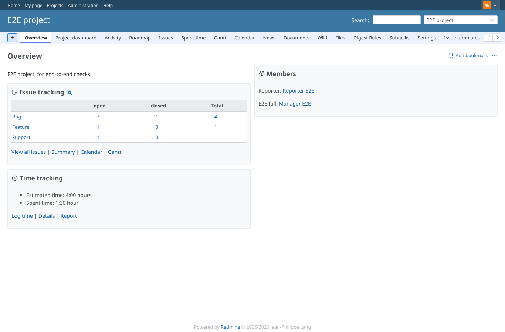
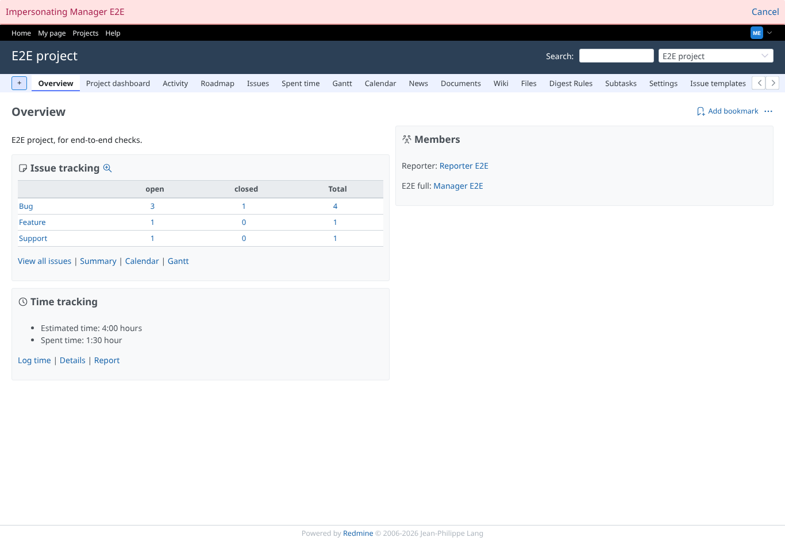

# impersonate

Run 2026-10-07T16:10:02.930Z against http://127.0.0.1:3000.

| screenshot | user | URL | shows |
|---|---|---|---|
|  | admin | `/projects/e2e-project` | Admin impersonating manager switches stealth on: the bar shows the impersonation, the header the stealth state |
|  | admin | `/projects/e2e-project` | After Cancel the admin's own stealth state is unchanged (off) |
|  | admin | `/projects/e2e-project` | Impersonating manager again: the setting changed earlier is stored on manager (decided: accepted) |
