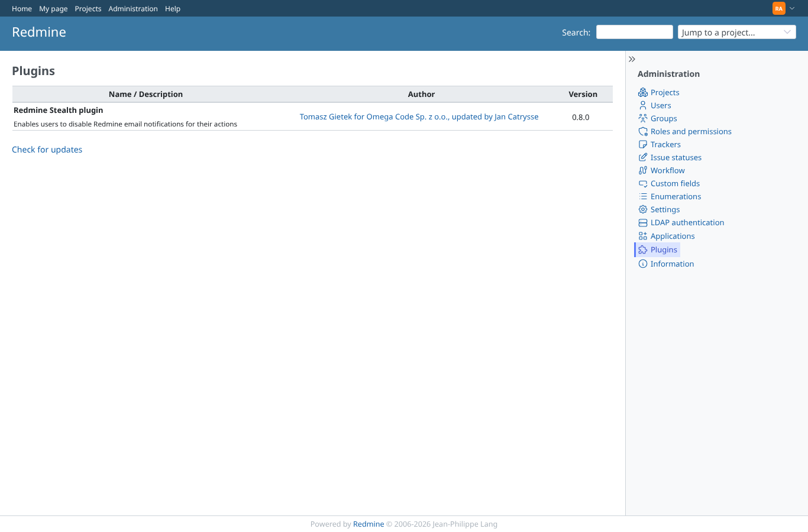

# impersonate

Run 2026-10-07T16:07:22.863Z against http://127.0.0.1:3000.

| screenshot | user | URL | shows |
|---|---|---|---|
|  | admin | `/admin/plugins` | redmine_impersonate is not installed here: nothing to check (run with the GEOxyz plugins) |
