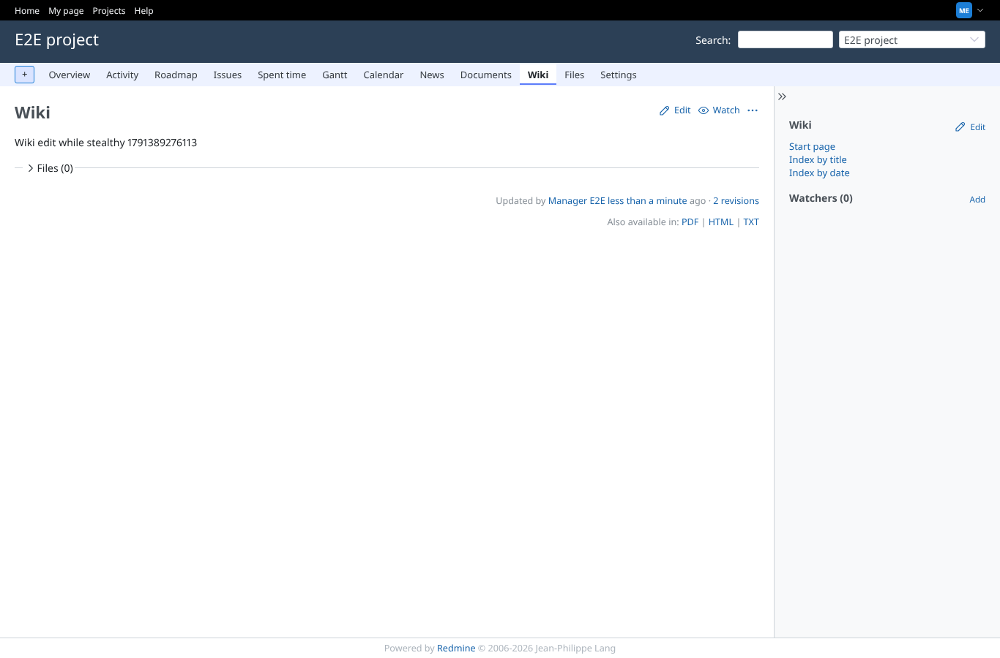
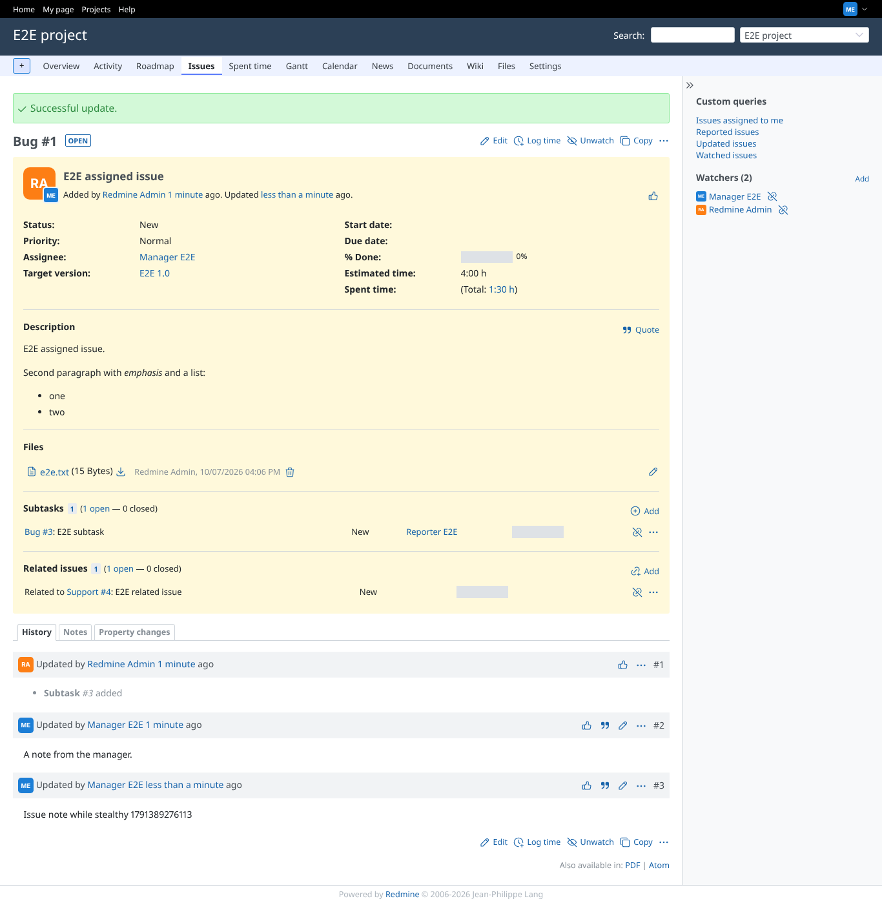

# mail_scope

Run 2026-10-07T16:08:13.450Z against http://127.0.0.1:3000.

| screenshot | user | URL | shows |
|---|---|---|---|
|  | manager | `/projects/e2e-project/wiki/Wiki` | Stealth on, wiki page edited: 1 new "'Wiki' wiki page has been updated" mail(s) to reporter (decided: wiki stays audible) |
|  | manager | `/issues/1` | Same session, stealth on, issue note added: 0 mail(s) |
