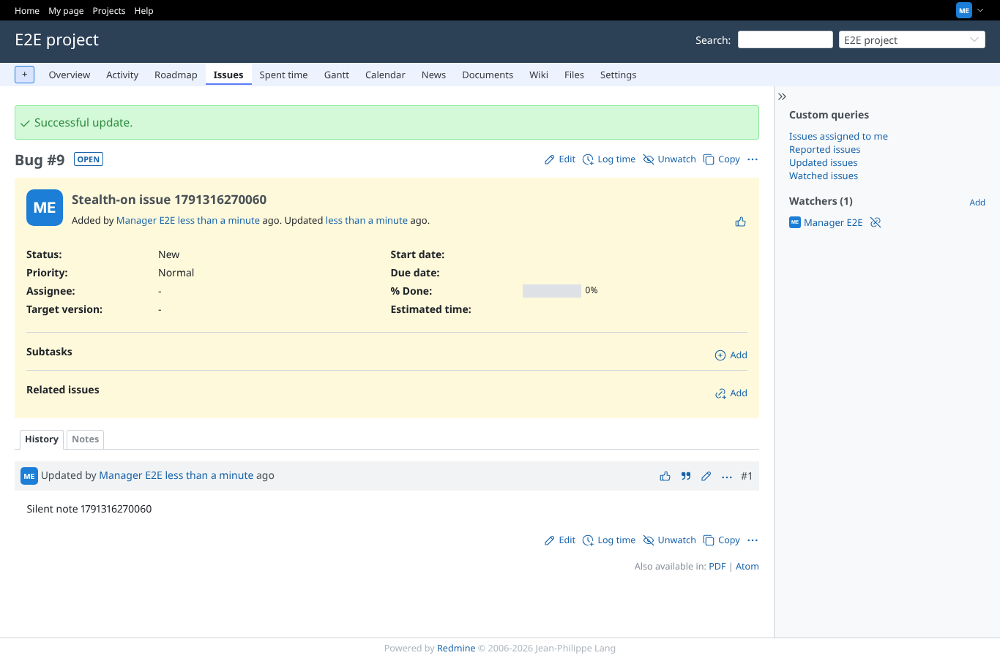

# mail

Run 2026-10-06T19:51:39.431Z against http://127.0.0.1:3000.

| screenshot | user | URL | shows |
|---|---|---|---|
|  | manager | `/issues/8` | Stealth off: new issue "Stealth-off issue 1791316270060", mail sent to reporter@example.net |
|  | manager | `/issues/9` | Stealth on: issue "Stealth-on issue 1791316270060" created and a note added, 0 mail(s) written |
|  | reporter | `/issues/9` | Another user without stealth adds a note to the same issue: mail sent to manager@example.net |
|  | manager | `/issues/9` | Stealth off again: the next note mails reporter@example.net |
