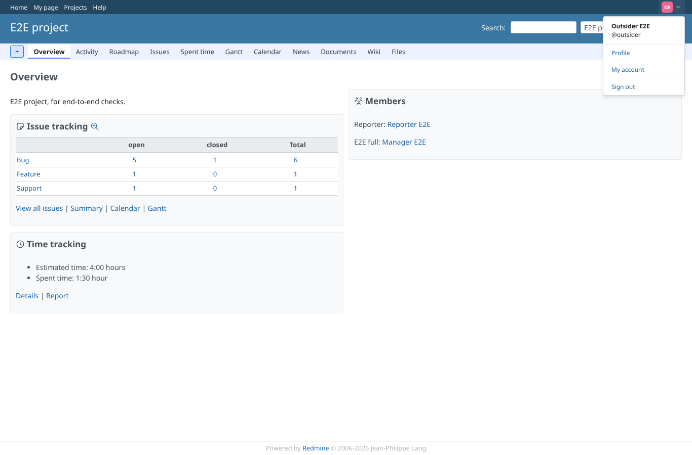
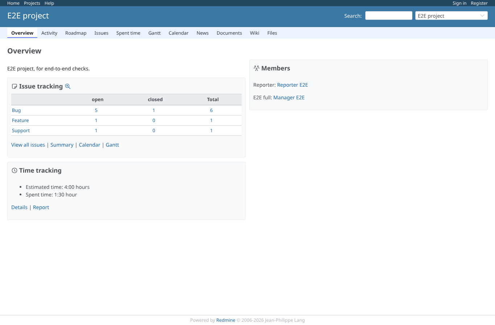
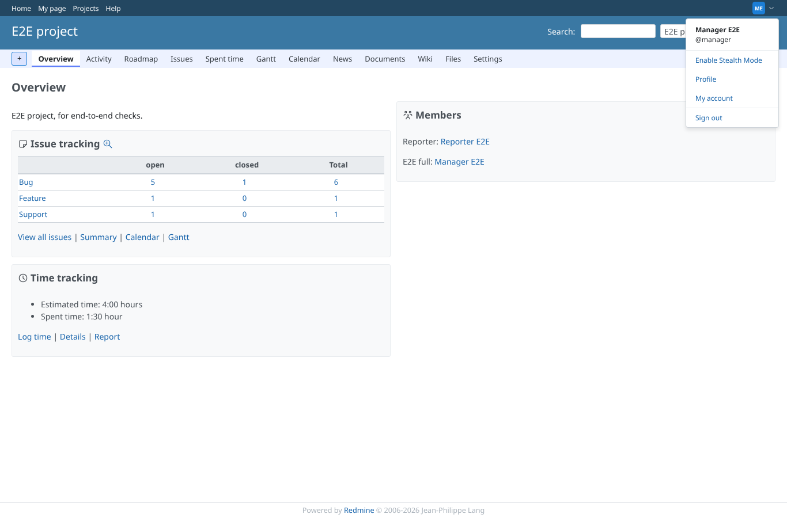
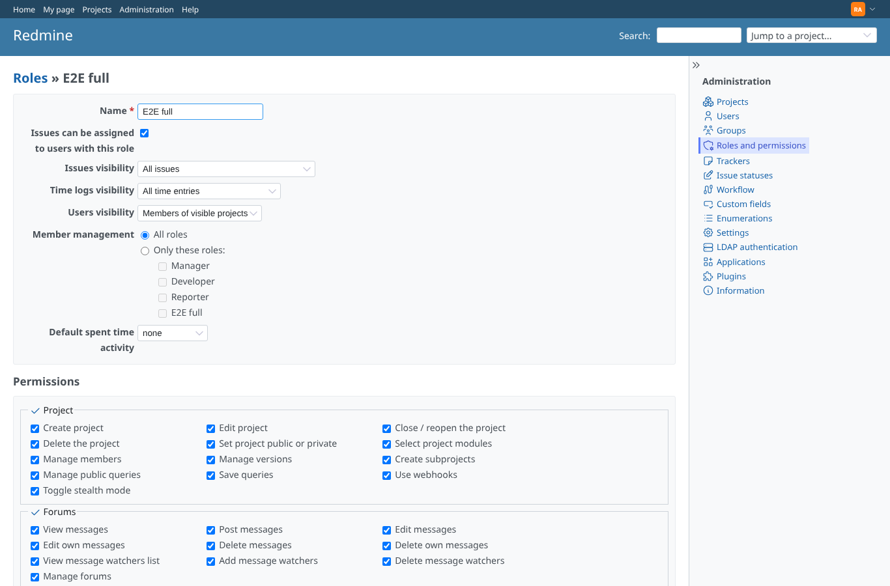

# permissions

Run 2026-10-06T20:17:35.586Z against http://127.0.0.1:3000.

| screenshot | user | URL | shows |
|---|---|---|---|
|  | reporter | `/projects/e2e-project` | reporter (member without the permission): no stealth item in the account menu |
|  | outsider | `/projects/e2e-project` | outsider (no membership): no stealth item in the account menu |
|  | anonymous | `/projects/e2e-project` | Anonymous: no account menu, no toggle; a POST is answered 401 |
|  | manager | `/projects/e2e-project` | manager (role with the permission): the toggle is offered |
|  | admin | `/roles/6/edit` | Administration > Roles: the "Toggle stealth mode" permission on a role |
