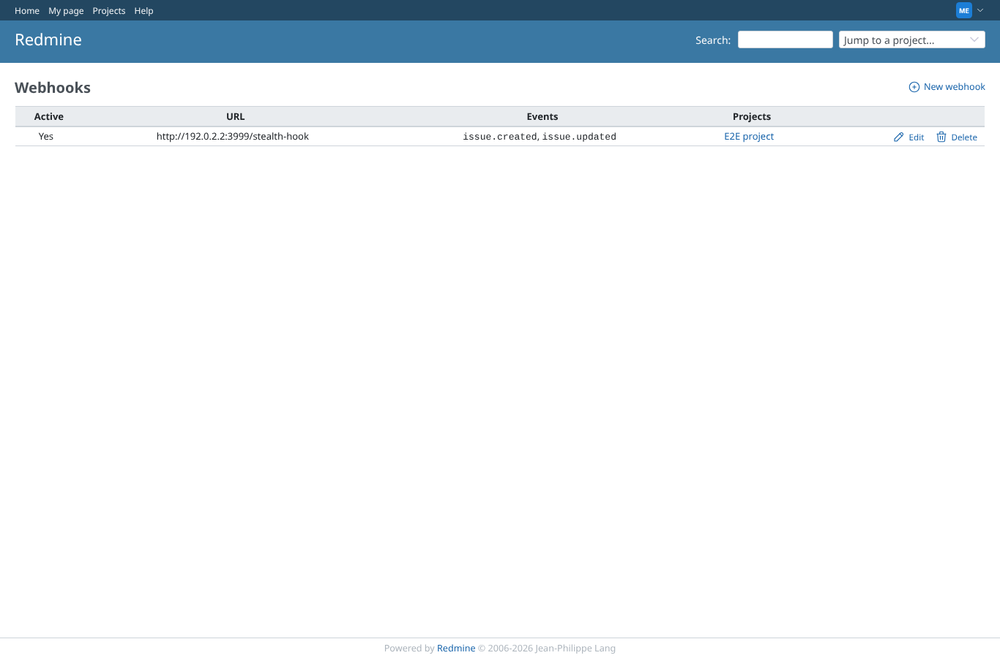
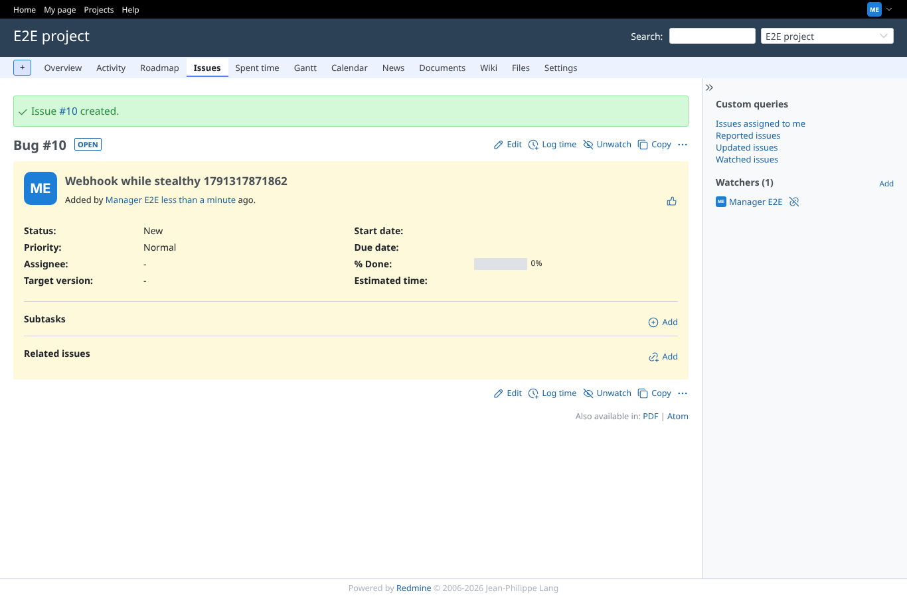

# webhook

Run 2026-10-06T20:17:54.301Z against http://127.0.0.1:3000.

| screenshot | user | URL | shows |
|---|---|---|---|
|  | manager | `/webhooks` | My webhooks: the seeded hook to http://192.0.2.2:3999/stealth-hook, issue created/updated on E2E project |
|  | manager | `/issues/10` | Stealth on: "Webhook while stealthy 1791317871862" created; webhook received ["issue.created"], 0 mail(s) |
